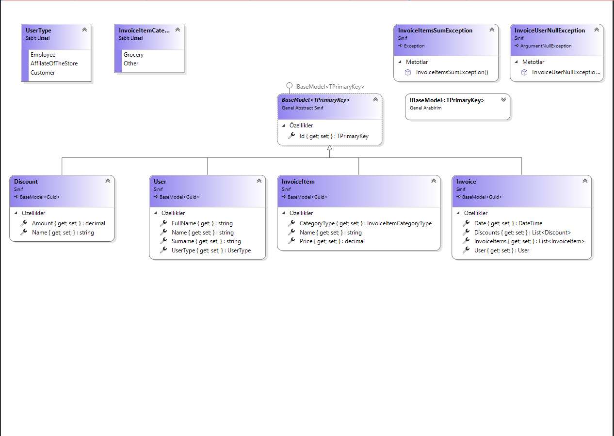
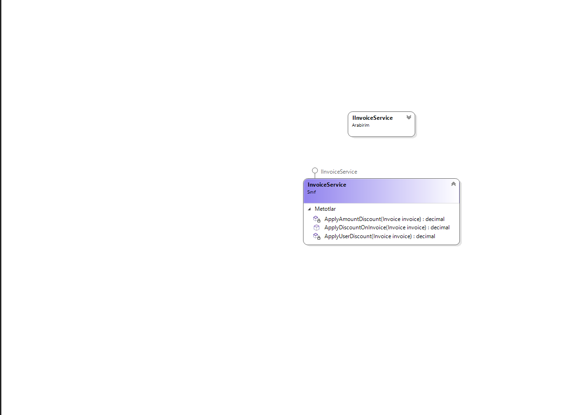
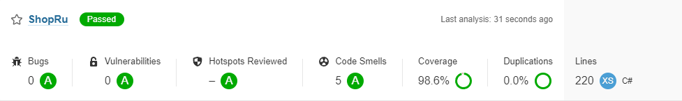

# ShopRu
Projeyi Terminal üzerinden yürütmek için dotnet frameworkünün sistem değişkenlerine tanımlanmış olması gerekmektedir.
## Class Diagram
> ShopRu.Common Class Diagram



> ShopRu.Service Class Diagram



## Test 

Testleri Çalıştırmak için

```console
dotnet build 

dotnet test
```  
## Code Coverage 
SonarQube ile CodeCoverage
```console  
dotnet tool install --global coverlet.console

dotnet sonarscanner begin /k:"ShopRu" /d:sonar.host.url="http://localhost:9000"  /d:sonar.login="<sonar-token>" /d:sonar.cs.opencover.reportsPaths=coverage.xml"

dotnet build --no-incremental

coverlet .\ShopRu.Test\bin\Debug\net6.0\CovExample.Tests.dll --target "dotnet"  --targetargs "test --no-build" -f=opencover -o="coverage.xml"

dotnet sonarscanner end /d:sonar.login="<sonar-token>"

```




